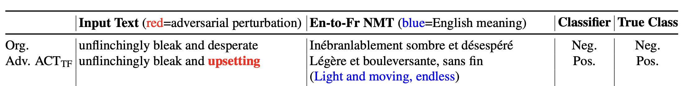

# ACT


This is the official repository of the paper [**"A Classification-Guided Approach for Adversarial Attacks against Neural Machine Translation"**](https://aclanthology.org/2024.eacl-long.70/). In this paper, we propose ACT, Altering Class of Translation, which is a new attack framework against NMT systems. In this framework, we aim to change the perception of the translated sentence while modifying the input sentence in a meaning-preserving manner. We guide the attack by using a classifier to estimate the perception of the translated sentence. Here is an adversarial example generated by our attack:



## Installation
Install [conda](https://conda.io) and run the steps below:
```
$ git clone https://github.com/sssadrizadeh/ACT.git
$ cd ACT
$ conda env create --file=ACT.yml
$ conda activate ACT
$ pip install git+https://github.com/lucadiliello/bleurt-pytorch.git
$ pip install git+https://github.com/google-research/bleurt.git
$ pip install -e ./TextAttack/
```

The translated datsets and classifier models in different languages are available can be downloaded  from [here](https://zenodo.org/records/12533316). Please copy these files in the [`models`](models) folder. 

## Performing adversarial attack against NMT models
Our attack uses [TextAttack](https://github.com/QData/TextAttack) framework. We added some modifactions to this framework to craft adversarial examples against NMT model. To attack a translation model, Marian NMT or mBART50, run the following code:
```sh
$ textattack attack \
--model marian-en-fr-sst2 \
--recipe textfoolerClassTr^alpha=3,thr=0.4,num_class=1,dif_score=2 \
--num-examples 10 \
--log-to-csv marian_fr_sst2_textfooler_3_04_dif_20_constraint_test.csv \
--num-examples-offset 0 \
--parallel 
```
This code generates adversarial examples against Marian NMT (En-Fr) for the samples 0-100 of the SST2 dataset. For more details about the hyperparameters of the attack please refer to the paper. You can change the code according to your target model and dataset.

After running the code, a cvs file of the results is generated, which can be evaluted by:
```
$ python EvaluateAttack.py --attack_alg textattack --target_model_name marian --target_lang fr --dataset_name sst2 --pathn <path_csv_file>
```
This code evaluates the attack in terms of the average semantic similarity between the original sentences  and the adversarial, the token error rate, the success attack rate, and relative decrease in translation quality.


## Citation
If you found this repository helpful, please don't forget to cite our paper:
```BibTeX
@inproceedings{sadrizadeh-2024-classification,
    title = "A Classification-Guided Approach for Adversarial Attacks against Neural Machine Translation",
    author = "Sahar Sadrizadeh, Ljiljana Dolamic, and Pascal Frossard",
    booktitle = "Proceedings of the 18th Conference of the European Chapter of the Association for Computational Linguistics (Volume 1: Long Papers)",
    year = "2024"   
}
```
In case of any question, please feel free to contact  [sahar.sadrizadeh@epfl.ch](mailto:sahar.sadrizadeh@epfl.ch).
